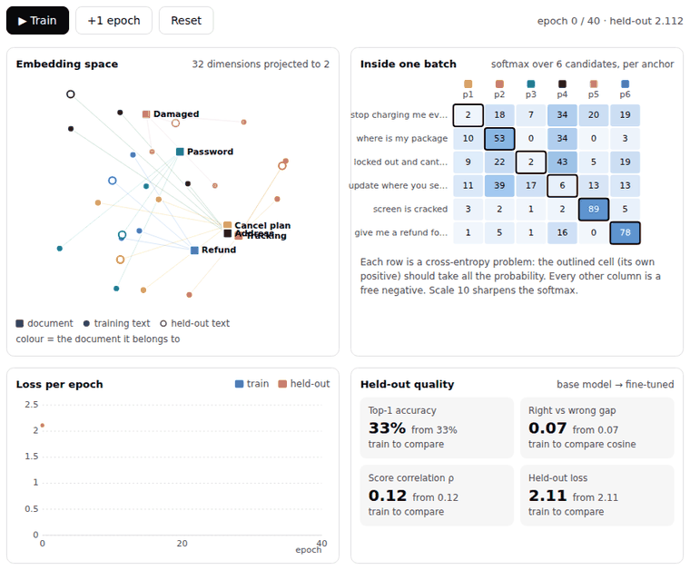

# Embedding Loss Playground

Fine-tune a tiny embedding model in your browser with seven [sentence-transformers](https://sbert.net) losses, and watch what each one actually does to the embedding space.



- **Try it:** open [`index.html`](index.html) (it runs straight from the file, no server needed), or use the live demo at **https://datamokotow.github.io/embedding-loss-playground/**
- **Read the write-up:** [Choosing an Embedding Loss Function](https://www.rutvikacharya.com/blog/embedding-loss-types), the blog post this playground was built for

## What you can do

- Pick one of **4 datasets** (help-centre search, product-review similarity, IT ticket routing, duplicate questions) and one of **7 losses**, then press **Train**.
- Watch four views update every epoch:
  - **Embedding space**: documents, training texts and held-out texts, projected to 2-D.
  - **Inside one batch**: the same batch drawn the way *that* loss sees it. That's a softmax matrix for MNRL, margin bands for TripletLoss, a score strip plot for CoSENT/CosineSimilarity, and hardest positive/negative picks for the batch-triplet losses.
  - **Loss per epoch**: training and held-out loss.
  - **Held-out quality**: top-1 accuracy, right-vs-wrong cosine gap, and Spearman correlation with the gold scores.
- Change epochs, learning rate, batch size, scale or margin, and turn the batch sampler on or off.
- Type your own query and compare the base model's ranking with the fine-tuned one.
- Copy the equivalent `sentence-transformers` training script for whatever you just ran.

## The seven losses

| Loss | Data format | What it optimises | Reach for it when |
| :--- | :--- | :--- | :--- |
| `MultipleNegativesRankingLoss` | `(anchor, positive)` | Each anchor must pick its own positive out of every positive in the batch (softmax / InfoNCE) | You have query→passage pairs. The default for retrieval. |
| MNRL + hard negatives | `(anchor, positive, negative)` | Same, with each row's near-miss added as an extra candidate | You can mine hard negatives |
| `TripletLoss` | `(anchor, positive, negative)` | `max(0, d(a,p) − d(a,n) + margin)`, zero once the margin is met | You want an explicit, interpretable margin |
| `CoSENTLoss` | `(text, text, score)` | Pairs with a higher gold score must have a higher cosine (order only) | You have graded similarity labels |
| `CosineSimilarityLoss` | `(text, text, score)` | `(cos − score)²`, regressing cosine onto the label | A simple baseline for scored pairs |
| `BatchAllTripletLoss` | `(text, label)` | Every same-label vs. other-label triplet in the batch that breaks the margin | You only have class labels |
| `BatchHardTripletLoss` | `(text, label)` | Only the hardest positive and hardest negative per anchor | Class labels, and you want the strongest signal |

The blog post explains each one in plain words, with worked examples.

## How it works

The model is deliberately small, so it trains in milliseconds and you can see every step:

- **Model:** each word is a 32-dimensional vector, and a sentence is the L2-normalised mean of its word vectors. The "pretrained" base knows a handful of generic synonym groups (parcel ≈ package, cracked ≈ broken), but nothing about the dataset's domain.
- **Losses:** each loss's forward pass and exact gradient with respect to the normalised embeddings are written out by hand in [`src/engine.js`](src/engine.js), then back-propagated through normalisation and pooling into the word vectors.
- **Optimiser:** Adam, updating only the word vectors that appear in each batch.
- **Projection:** PCA to 2-D, rotated each epoch to line up with the previous frame so the map doesn't flip.

A real transformer would get different absolute numbers, but each loss behaves the same way: MNRL keeps pushing, triplets stop at the margin, CoSENT only cares about order.

## Run it locally

No install is needed for the playground itself. Open `index.html`.

```bash
npm test            # gradient check for every loss + a training sanity check
npm run build       # rebuild index.html after editing src/
npm run export-data # refresh python/datasets.json from src/data.js
```

Every push to `main` runs the tests and publishes `index.html` to GitHub Pages through [`.github/workflows/pages.yml`](.github/workflows/pages.yml). The workflow also fails if `index.html` wasn't rebuilt after a change to `src/`.

`npm test` compares every hand-written gradient against central finite differences, both per loss and through the full model, and checks that 40 epochs of each loss lowers held-out loss.

## Train a real model with the same setup

[`python/train.py`](python/train.py) runs the same datasets and losses through `sentence-transformers` on a real model (all-MiniLM-L6-v2 by default) and prints before/after accuracy:

```bash
pip install -r python/requirements.txt
python python/train.py --loss mnrl
python python/train.py --loss cosent --dataset similarity
python python/train.py --loss batchhard --dataset clustering --epochs 5
```

`python python/smoke_test.py` runs all seven losses end to end on a tiny local model, with no downloads, which is handy for CI.

## Project layout

```
index.html              standalone playground (generated; CSS and JS inlined)
src/
  engine.js             model, 7 losses with gradients, Adam, batching, evaluation, PCA
  data.js               the 4 datasets, tokenizer, and a catalog of all 29 sentence-transformers losses
  playground.js         framework-free UI: mountPlayground(element)
  playground.css        styles (theme via CSS variables, light and dark)
astro/                  drop-in Astro components (see astro/README.md)
python/                 train.py, smoke_test.py, datasets.json
tests/gradcheck.mjs     gradient and training checks
scripts/                build.mjs (index.html), export-data.mjs
```

## Embed it in your own page

```html
<link rel="stylesheet" href="src/playground.css">
<div id="playground"></div>
<script type="module">
  import { mountPlayground } from './src/playground.js'
  mountPlayground(document.getElementById('playground'))
</script>
```

Any element with `data-ll-loss="triplet"` (plus optional `data-ll-world="similarity"` and `data-ll-cfg='{"margin":0}'`) becomes a button that loads that setup into the playground and starts training.

The stylesheet reads colours from a few CSS variables (`--foreground`, `--background`, `--border`, `--primary`, `--muted-foreground`); see [`astro/README.md`](astro/README.md) for values.

## Add your own dataset

Add an entry to `WORLDS` in [`src/data.js`](src/data.js) with six documents (`groups`), training and test texts (`train`, `test`), a hard negative for each document (`hardneg`), and pairs of related documents (`related`, used for the 0.4 scores). Then run `npm run build`. If words in your domain are generic synonyms a pretrained model would already know, add them to `GENERIC`.

## License

[MIT](LICENSE)
